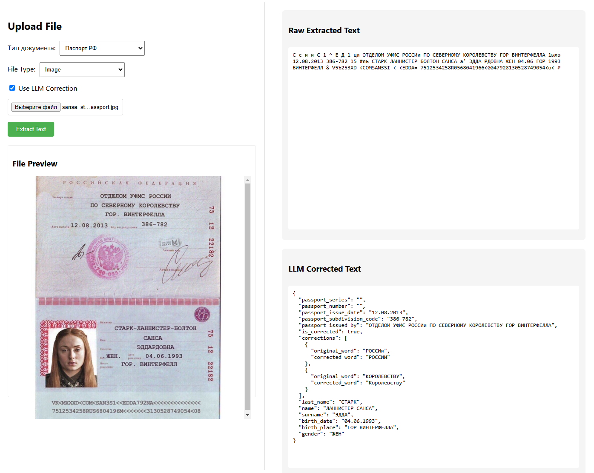

# DocumentsToTextService <sub><sup>`v0.0.0 (beta)`</sup></sub>


Сервис для распознавания текста из изображений и PDF-файлов с интеллектуальной коррекцией результатов через LLM



## 🌟 Особенности

- Распознавание текста из изображений (JPG/JPEG/PNG) и PDF-документов
- Поддержка многостраничных PDF-документов
- Готовые шаблоны для популярных документов:
  - Паспорт РФ
  - СНИЛС
  - Загранпаспорт
- Автоматическая постобработка текста:
  - Бинаризация изображений
  - Выравнивание перспективы
  - Коррекция контраста
  - Удаление артефактов
- Веб-интерфейс на React для демонстрации возможностей

## ⚠️ Важно
Проект находится в активной разработке. Основные направления:
- Предварительная сегментация документов и обработка шаблонов для лучшего распознования
- Улучшение алгоритмов предобработки
- Добавление docker-compose
- Интеграция с PostgreSQL
- Добавление новых шаблонов документов

## 🚀 Быстрый старт

### Бэкенд (FastAPI)

```bash
# Скопируйте и настройте переменные окружения
cp backend/.env-template backend/.env

# Установите зависимости
cd backend
python -m venv venv
source venv/bin/activate  # Для Windows: venv\Scripts\activate
pip install -r requirements.txt

# Запустите сервер
cd app
uvicorn main:app --host 0.0.0.0 --port 80

```

### Фронтенд (React)

```bash
cd frontend
npm install
npm start
```

## 🔄 Схема работы

### 1. Получение документа
- Пользователь загружает файл через веб-интерфейс или API

### 2. Предобработка изображения
- Конвертация в grayscale
- Автоматическая бинаризация
- Выравнивание перспективы
- Удаление шумов

### 3. OCR обработка
- Распознавание текста с помощью EasyOCR (поддержка 80+ языков), tesseract или любой кастомной python-модели.

### 4. Постобработка текста с помощью LLM-сервиса
- Сборка текста в структурированный формат
- Применение шаблонов для документов
- Формирование контекстного промпта для LLM
- Коррекция через LLM

Промпты находятся в `backend\app\core\llm_formater_promts`

### 5. Возврат результатов
- Сырой текст
- Скорректированный текст (при запросе с коррекцией с помощью LLM)
- Статус обработки

